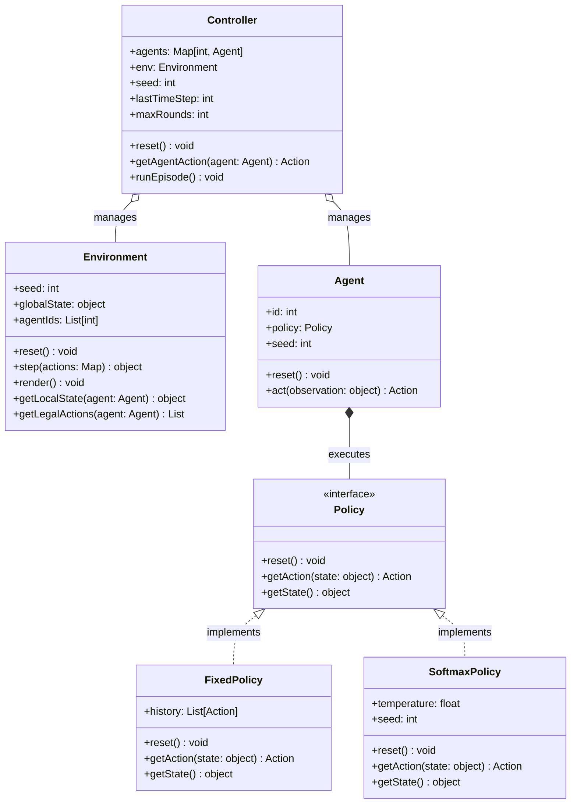

```mermaid
    classDiagram
    class Environment {
    +seed: int
    +globalState: object
    +agentIds: List[int]
    +reset() void
    +step(actions: Map) object
    +render() void
    +getLocalState(agent: Agent) object
    +getLegalActions(agent: Agent) List
    }

        class Controller {
            +agents: Map[int, Agent]
            +env: Environment
            +seed: int
            +lastTimeStep: int
            +maxRounds: int
            +reset() void
            +getAgentAction(agent: Agent) Action
            +runEpisode() void
        }

        class Agent {
            +id: int
            +policy: Policy
            +seed: int
            +reset() void
            +act(observation: object) Action
        }

        class Policy {
            <<interface>>
            +reset() void
            +getAction(state: object) Action
            +getState() object
        }

        class FixedPolicy {
            +history: List[Action]
            +reset() void
            +getAction(state: object) Action
            +getState() object
        }

        class SoftmaxPolicy {
            +temperature: float
            +seed: int
            +reset() void
            +getAction(state: object) Action
            +getState() object
        }

        %% Relationships
        Controller o-- Environment : manages
        Controller o-- Agent : manages
        Agent *-- Policy : executes
        Policy <|.. FixedPolicy : implements
        Policy <|.. SoftmaxPolicy : implements
```
