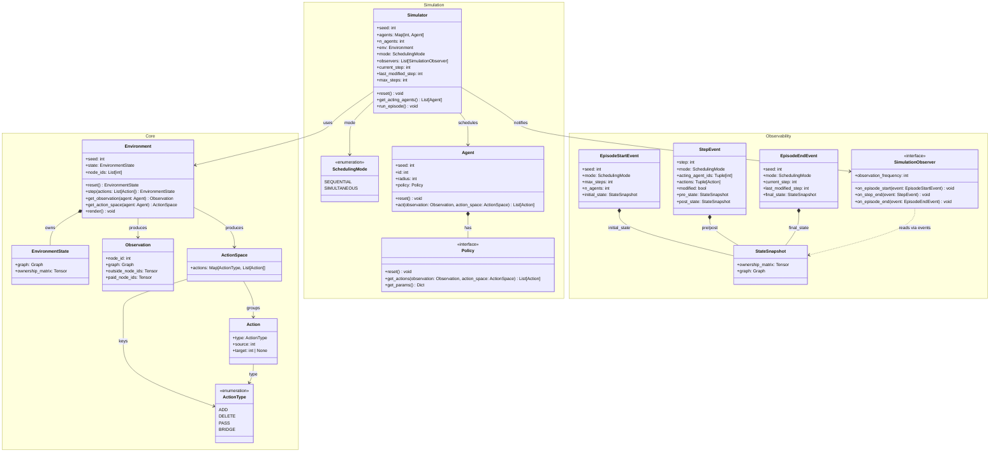

```mermaid
    classDiagram

    namespace Core {
        class Environment {
            +seed: int
            +state: EnvironmentState
            +node_ids: List[int]
            +reset() EnvironmentState
            +step(actions: List[Action]) EnvironmentState
            +get_observation(agent: Agent) Observation
            +get_action_space(agent: Agent) ActionSpace
            +render() void
        }

        class EnvironmentState {
            +graph: Graph
            +ownership_matrix: Tensor
        }

        class Observation {
            +node_id: int
            +graph: Graph
            +outside_node_ids: Tensor
            +paid_node_ids: Tensor
        }

        class ActionSpace {
            +actions: Map[ActionType, List[Action]]
        }

        class ActionType {
            <<enumeration>>
            ADD
            DELETE
            PASS
            BRIDGE
        }

        class Action {
            +type: ActionType
            +source: int
            +target: int | None
        }
    }

    namespace Simulation {
        class SchedulingMode {
            <<enumeration>>
            SEQUENTIAL
            SIMULTANEOUS
        }

        class Simulator {
            +seed: int
            +agents: Map[int, Agent]
            +n_agents: int
            +env: Environment
            +mode: SchedulingMode
            +observers: List[SimulationObserver]
            +current_step: int
            +last_modified_step: int
            +max_steps: int
            +reset() void
            +get_acting_agents() List[Agent]
            +run_episode() void
        }

        class Agent {
            +seed: int
            +id: int
            +radius: int
            +policy: Policy
            +reset() void
            +act(observation: Observation, action_space: ActionSpace) List[Action]
        }

        class Policy {
            <<interface>>
            +reset() void
            +get_actions(observation: Observation, action_space: ActionSpace) List[Action]
            +get_params() Dict
        }
    }

    namespace Observability {
        class StateSnapshot {
            +ownership_matrix: Tensor
            +graph: Graph
        }

        class EpisodeStartEvent {
            +seed: int
            +mode: SchedulingMode
            +max_steps: int
            +n_agents: int
            +initial_state: StateSnapshot
        }

        class StepEvent {
            +step: int
            +mode: SchedulingMode
            +acting_agent_ids: Tuple[int]
            +actions: Tuple[Action]
            +modified: bool
            +pre_state: StateSnapshot
            +post_state: StateSnapshot
        }

        class EpisodeEndEvent {
            +seed: int
            +mode: SchedulingMode
            +current_step: int
            +last_modified_step: int
            +final_state: StateSnapshot
        }

        class SimulationObserver {
            <<interface>>
            +observation_frequency: int
            +on_episode_start(event: EpisodeStartEvent) void
            +on_step_end(event: StepEvent) void
            +on_episode_end(event: EpisodeEndEvent) void
        }
    }


    %% Relationships
    Simulator --> Environment : uses
    Simulator --> Agent : schedules
    Simulator --> SchedulingMode : mode
    Simulator --> SimulationObserver : notifies
    Environment *-- EnvironmentState : owns
    Environment --> Observation : produces
    Environment --> ActionSpace : produces
    EpisodeStartEvent *-- StateSnapshot : initial_state
    StepEvent *-- StateSnapshot : pre/post
    EpisodeEndEvent *-- StateSnapshot : final_state
    SimulationObserver ..> StateSnapshot : reads via events
    ActionSpace --> ActionType : keys
    ActionSpace --> Action : groups
    Action --> ActionType : type
    Agent *-- Policy : has
```
