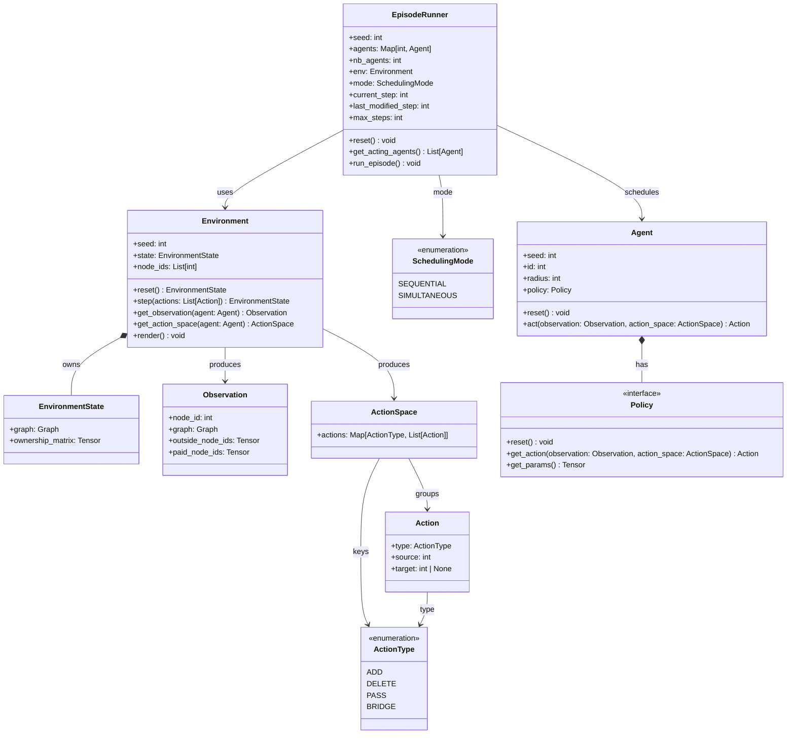

```mermaid
    classDiagram

    class Environment {
        +seed: int
        +state: EnvironmentState
        +node_ids: List[int]
        +reset() EnvironmentState
        +step(actions: List[Action]) EnvironmentState
        +get_observation(agent: Agent) Observation
        +get_action_space(agent: Agent) ActionSpace
        +render() void
    }

    class EnvironmentState {
        +graph: Graph
        +ownership_matrix: Tensor
    }

    class Observation {
        +node_id: int
        +graph: Graph
        +outside_node_ids: Tensor
        +paid_node_ids: Tensor
    }

    class ActionSpace {
        +actions: Map[ActionType, List[Action]]
    }

    class ActionType {
        <<enumeration>>
        ADD
        DELETE
        PASS
        BRIDGE
    }

    class Action {
        +type: ActionType
        +source: int
        +target: int | None
    }

    class SchedulingMode {
        <<enumeration>>
        SEQUENTIAL
        SIMULTANEOUS
    }

    class EpisodeRunner {
        +seed: int
        +agents: Map[int, Agent]
        +nb_agents: int
        +env: Environment
        +mode: SchedulingMode
        +current_step: int
        +last_modified_step: int
        +max_steps: int
        +reset() void
        +get_acting_agents() List[Agent]
        +run_episode() void
    }

    class Agent {
        +seed: int
        +id: int
        +radius: int
        +policy: Policy
        +reset() void
        +act(observation: Observation, action_space: ActionSpace) Action
    }

    class Policy {
        <<interface>>
        +reset() void
        +get_action(observation: Observation, action_space: ActionSpace) Action
        +get_params() Tensor
    }


    %% Relationships
    EpisodeRunner --> Environment : uses
    EpisodeRunner --> Agent : schedules
    EpisodeRunner --> SchedulingMode : mode
    Environment *-- EnvironmentState : owns
    Environment --> Observation : produces
    Environment --> ActionSpace : produces
    ActionSpace --> ActionType : keys
    ActionSpace --> Action : groups
    Action --> ActionType : type
    Agent *-- Policy : has
```
