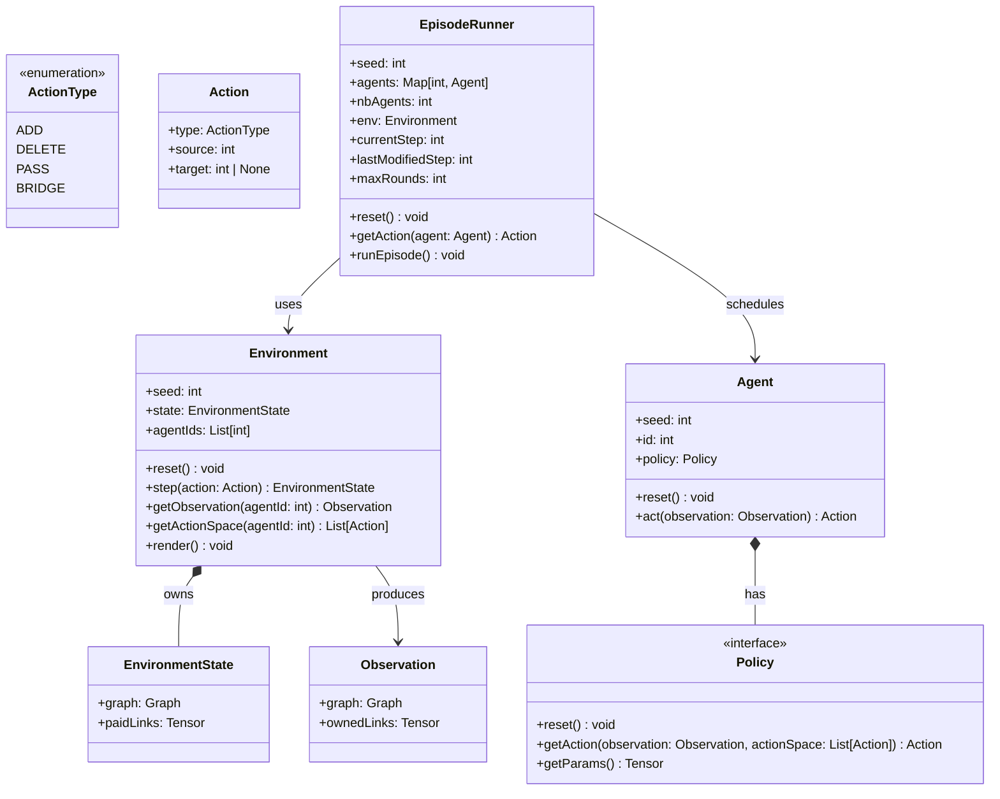

```mermaid
    classDiagram

    class Environment {
        +seed: int
        +state: EnvironmentState
        +agentIds: List[int]
        +reset() void
        +step(action: Action) EnvironmentState
        +getObservation(agentId: int) Observation
        +getActionSpace(agentId: int) List[Action]
        +render() void
    }

    class EnvironmentState {
        +graph: Graph
        +paidLinks: Tensor
    }

    class Observation {
        +graph: Graph
        +ownedLinks: Tensor
    }

    class ActionType {
        <<enumeration>>
        ADD
        DELETE
        PASS
        BRIDGE
    }

    class Action {
        +type: ActionType
        +source: int
        +target: int | None
    }

    class EpisodeRunner {
        +seed: int
        +agents: Map[int, Agent]
        +nbAgents: int
        +env: Environment
        +currentStep: int
        +lastModifiedStep: int
        +maxRounds: int
        +reset() void
        +getAction(agent: Agent) Action
        +runEpisode() void
    }

    class Agent {
        +seed: int
        +id: int
        +policy: Policy
        +reset() void
        +act(observation: Observation) Action
    }

    class Policy {
        <<interface>>
        +reset() void
        +getAction(observation: Observation, actionSpace: List[Action]) Action
        +getParams() Tensor
    }


    %% Relationships
    EpisodeRunner --> Environment : uses
    EpisodeRunner --> Agent : schedules
    Environment *-- EnvironmentState : owns
    Environment --> Observation : produces
    Agent *-- Policy : has
```
