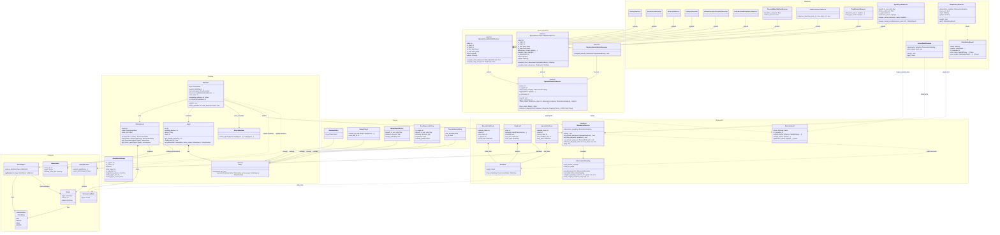

```mermaid
classDiagram

namespace CoreModel {
    class ActionType {
        <<enumeration>>
        ADD
        DELETE
        PASS
        BRIDGE
    }

    class Action {
        +type: ActionType
        +source: int
        +target: int | None
    }

    class PolicyDecision {
        +actions: tuple[Action, ...]
        +value: dict[str, object] | None
    }

    class ActionSpace {
        +actions: dict[ActionType, list[Action]]
        +__getitem__(action_type: ActionType) list[Action]
    }

    class EnvironmentState {
        +graph: Graph
    }

    class Observation {
        +node_idx: int
        +graph: Graph
        +outside_node_idxs: NDArray
    }
}

namespace Runtime {
    class SimulationSettings {
        +n_agents: int
        +n_actors: int
        +seed: int
        +max_steps: int
        +n_episodes: int
        +stagnation_patience: int | None
        +initial_graph_kind: str
        +initial_graph_p: float | None
    }

    class Environment {
        +seed: int
        +state: EnvironmentState
        +node_ids: list[int]
        +reset(seed: int | None) EnvironmentState
        +step(actions: Sequence[Action]) EnvironmentState
        +get_observation(agent: Agent) Observation
        +get_action_space(agent: Agent) ActionSpace
    }

    class Agent {
        +id: int
        +visibility_distance: int
        +policy: Policy
        +seed: int
        +get_visibility_distance() int
        +reset(seed: int) void
        +act(observation: Observation, action_space: ActionSpace) PolicyDecision
    }

    class Policy {
        <<abstract>>
        +reset(seed: int) void
        +get_decision(observation: Observation, action_space: ActionSpace) PolicyDecision
    }

    class ActorScheduler {
        +select_agents(agents: tuple[Agent, ...]) tuple[Agent, ...]
    }

    class Simulator {
        +env: Environment
        +agents: tuple[Agent, ...]
        +actor_scheduler: ActorScheduler
        +observers: tuple[SimulationObserver, ...]
        +max_steps: int
        +stagnation_patience: int | None
        +n_completed_episodes: int
        +reset() void
        +run(n_episodes: int, reset_observers: bool) void
    }
}

namespace Policies {
    class RandomPolicy {
        +p_act: float | None
    }

    class ReplayPolicy {
        +actions_by_step: dict[int, tuple[Action, ...]]
        +next_step_id: int
    }

    class MyopicPayoffPolicy {
        +benefit_to_cost_ratio: float
        +distance_discount: float
        +bridge_probability: float
    }

    class BestResponsePolicy {
        +n_nodes: int
        +benefit_to_cost_ratio: float
        +distance_discount: float
        +exploration: float
        +outside_optimism: float
    }

    class ThresholdLinkPolicy {
        +link_threshold: float
        +p_act: float
    }
}

namespace ObserverAPI {
    class ObservationSampling {
        +kind: periodic | terminal
        +every: int | None
        +periodic(every: int) ObservationSampling
        +terminal() ObservationSampling
        +samples_step(step_index: int, max_steps: int) bool
        +fixed_sample_count(max_steps: int) int
    }

    class StateView {
        +graph: Graph
        +from_state(state: EnvironmentState) StateView
    }

    class EpisodeStartEvent {
        +episode_index: int
        +seed: int
        +max_steps: int
        +n_agents: int
        +initial_state: StateView
    }

    class StepEvent {
        +step: int
        +decisions: tuple[PolicyDecision, ...]
        +modified: bool
        +pre_state: StateView
        +post_state: StateView
    }

    class EpisodeEndEvent {
        +episode_index: int
        +seed: int
        +current_step: int
        +last_modified_step: int
        +final_state: StateView
    }

    class StatisticResult {
        +steps: NDArray | None
        +n_episodes: int
        +outputs: dict[str, NDArray | tuple[NDArray, ...]]
        +sample_shape: tuple[int, ...]
        +dimension_names: tuple[str, ...] | None
    }

    class SimulationObserver {
        <<interface>>
        +observation_sampling: ObservationSampling
        +reset() void
        +on_episode_start(event: EpisodeStartEvent) void
        +on_step_end(event: StepEvent) void
        +on_episode_end(event: EpisodeEndEvent) void
        +observes_step(step_index: int, max_steps: int) bool
        +get() Any
    }
}

namespace ObserverStatistics {
    class EpisodeStatisticObserver {
        <<abstract>>
        +name: str
        +n_agents: int
        +observation_sampling: ObservationSampling
        +aggregations: tuple[str, ...]
        +n_episodes: int
        +reset() void
        +get() StatisticResult
        +fixed_output_shape(max_steps: int, observation_sampling: ObservationSampling) tuple[int, ...]
        +fixed_output_dtype() dtype
        +reference_values(context: Mapping, references: Mapping | None) dict[str, float | None]
    }

    class EpisodeSeriesStatisticObserver {
        <<abstract>>
        +label: str
        +x_label: str
        +y_label: str
        +y_min: float | None
        +y_max: float | None
        +steps: NDArray
        +values: NDArray
        +compute_initial_value(event: EpisodeStartEvent) float
        +compute_step_value(event: StepEvent) float
    }

    class EpisodeSeriesTensorStatisticObserver {
        <<abstract>>
        +label: str
        +x_label: str
        +y_label: str
        +y_min: float | None
        +y_max: float | None
        +dimension_names: tuple[str, ...]
        +sample_shape: tuple[int, ...]
        +n_dimensions: int
        +steps: NDArray
        +values: NDArray
        +compute_initial_value(event: EpisodeStartEvent) NDArray
        +compute_step_value(event: StepEvent) NDArray
    }

    class EpisodeScalarStatisticObserver {
        <<abstract>>
        +compute_terminal_value(event: EpisodeEndEvent) float
    }
}

namespace Observers {
    class DensityObserver
    class ActionCountObserver
    class DistanceObserver
    class IndegreeObserver
    class GlobalClosenessCentralityObserver
    class CentralPointOfDominanceObserver

    class CenteredMeanWelfareObserver {
        +benefit_to_cost_ratio: float
        +distance_discount: float
    }

    class HubPersistenceObserver {
        +observes_step(step_index: int, max_steps: int) bool
    }

    class TriadCensusObserver {
        +dimension_names: tuple[str, ...]
        +triad_type_names: tuple[str, ...]
    }

    class AgentPayoffObserver {
        +benefit_to_cost_ratio: float
        +distance_discount: float
        +n_agent_slots: int
        +dimension_names: tuple[str, ...]
        +degree_ranked_dimension_names: tuple[str, ...]
        +degree_ranked_result(dimension_name: str) StatisticResult
    }

    class StateHistoryResult {
        +steps: NDArray
        +graphs: tuple[Graph, ...]
        +n_episodes: int
        +runs_steps: tuple[NDArray, ...] | None
        +runs_graphs: tuple[tuple[Graph, ...], ...] | None
    }

    class StateHistoryObserver {
        +observation_sampling: ObservationSampling
        +keep_runs: bool
        +steps: NDArray
        +graphs: NDArray
        +reset() void
        +get() StateHistoryResult
    }

    class ActionPrintObserver {
        +observation_sampling: ObservationSampling
        +print_empty_steps: bool
        +reset() void
        +get() None
    }
}

%% Relationships
Environment *-- EnvironmentState : owns
Environment --> Observation : produces
Environment --> ActionSpace : produces local actions
ActionSpace --> ActionType : keys
ActionSpace --> Action : local candidates
PolicyDecision --> Action : contains
Action --> ActionType : type

Agent *-- Policy : has
Simulator --> Environment : uses
Simulator --> Agent : schedules
Simulator --> ActorScheduler : actor_scheduler
Simulator --> SimulationObserver : notifies
Simulator ..> Observation : passes to policies
Simulator ..> PolicyDecision : applies decisions

RandomPolicy --|> Policy : extends
ReplayPolicy --|> Policy : extends
MyopicPayoffPolicy --|> Policy : extends
BestResponsePolicy --|> Policy : extends
ThresholdLinkPolicy --|> Policy : extends

SimulationObserver --> ObservationSampling : sampling
StateView ..> EnvironmentState : from_state
EpisodeStartEvent *-- StateView : initial_state
StepEvent *-- StateView : pre/post
StepEvent --> PolicyDecision : decisions
EpisodeEndEvent *-- StateView : final_state
SimulationObserver ..> StateView : reads via events

EpisodeStatisticObserver ..|> SimulationObserver : implements
EpisodeStatisticObserver ..> StatisticResult : returns
EpisodeSeriesStatisticObserver --|> EpisodeStatisticObserver : extends
EpisodeSeriesTensorStatisticObserver --|> EpisodeStatisticObserver : extends
EpisodeScalarStatisticObserver --|> EpisodeStatisticObserver : extends

DensityObserver --|> EpisodeSeriesStatisticObserver : extends
ActionCountObserver --|> EpisodeSeriesStatisticObserver : extends
DistanceObserver --|> EpisodeSeriesStatisticObserver : extends
IndegreeObserver --|> EpisodeSeriesStatisticObserver : extends
GlobalClosenessCentralityObserver --|> EpisodeSeriesStatisticObserver : extends
CentralPointOfDominanceObserver --|> EpisodeSeriesStatisticObserver : extends
CenteredMeanWelfareObserver --|> EpisodeSeriesStatisticObserver : extends
HubPersistenceObserver --|> EpisodeSeriesStatisticObserver : extends
TriadCensusObserver --|> EpisodeSeriesTensorStatisticObserver : extends
AgentPayoffObserver --|> EpisodeSeriesTensorStatisticObserver : extends
AgentPayoffObserver ..> StatisticResult : degree_ranked_result
StateHistoryObserver ..|> SimulationObserver : implements
StateHistoryObserver ..> StateHistoryResult : returns
ActionPrintObserver ..|> SimulationObserver : implements
```
