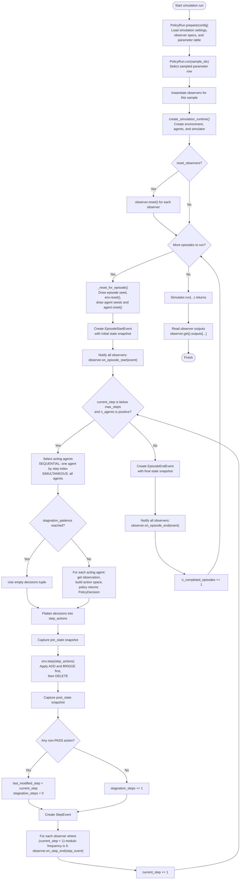

```mermaid
flowchart TD
    Start(["Start simulation run"])
    Prepare["PolicyRun.prepare(config)<br/>Load simulation settings,<br/>observer specs, and parameter table"]
    RunSample["PolicyRun.run(sample_idx)<br/>Select sampled parameter row"]
    BuildObservers["Instantiate observers for this sample"]
    BuildRuntime["create_simulation_runtime()<br/>Create environment, agents, and simulator"]
    ResetObservers{"reset_observers?"}
    ClearObservers["observer.reset() for each observer"]
    EpisodeLoop{"More episodes to run?"}
    ResetEpisode["_reset_for_episode()<br/>Draw episode seed,<br/>env.reset(),<br/>draw agent seeds and agent.reset()"]
    EpisodeStart["Create EpisodeStartEvent<br/>with initial state snapshot"]
    NotifyEpisodeStart["Notify all observers:<br/>observer.on_episode_start(event)"]
    StepLoop{"current_step is below max_steps<br/>and n_agents is positive?"}
    SelectActors["Select acting agents<br/>SEQUENTIAL: one agent by step index<br/>SIMULTANEOUS: all agents"]
    Stagnated{"stagnation_patience reached?"}
    SkipDecisions["Use empty decisions tuple"]
    GatherDecisions["For each acting agent:<br/>get observation,<br/>build action space,<br/>policy returns PolicyDecision"]
    FlattenActions["Flatten decisions into step_actions"]
    CapturePre["Capture pre_state snapshot"]
    ApplyStep["env.step(step_actions)<br/>Apply ADD and BRIDGE first,<br/>then DELETE"]
    CapturePost["Capture post_state snapshot"]
    Modified{"Any non-PASS action?"}
    ResetStagnation["last_modified_step = current_step<br/>stagnation_steps = 0"]
    AdvanceStagnation["stagnation_steps += 1"]
    StepEvent["Create StepEvent"]
    NotifyStep["For each observer where<br/>(current_step + 1) modulo frequency is 0:<br/>observer.on_step_end(step_event)"]
    AdvanceStep["current_step += 1"]
    EpisodeEnd["Create EpisodeEndEvent<br/>with final state snapshot"]
    NotifyEpisodeEnd["Notify all observers:<br/>observer.on_episode_end(event)"]
    CountEpisode["n_completed_episodes += 1"]
    SimulationDone["Simulator.run(...) returns"]
    CollectOutputs["Read observer outputs<br/>observer.get().outputs[...]"]
    End(["Finish"])

    Start --> Prepare --> RunSample --> BuildObservers --> BuildRuntime --> ResetObservers
    ResetObservers -- Yes --> ClearObservers --> EpisodeLoop
    ResetObservers -- No --> EpisodeLoop

    EpisodeLoop -- Yes --> ResetEpisode --> EpisodeStart --> NotifyEpisodeStart --> StepLoop
    EpisodeLoop -- No --> SimulationDone --> CollectOutputs --> End

    StepLoop -- Yes --> SelectActors --> Stagnated
    StepLoop -- No --> EpisodeEnd --> NotifyEpisodeEnd --> CountEpisode --> EpisodeLoop

    Stagnated -- Yes --> SkipDecisions --> FlattenActions
    Stagnated -- No --> GatherDecisions --> FlattenActions

    FlattenActions --> CapturePre --> ApplyStep --> CapturePost --> Modified
    Modified -- Yes --> ResetStagnation --> StepEvent
    Modified -- No --> AdvanceStagnation --> StepEvent

    StepEvent --> NotifyStep --> AdvanceStep --> StepLoop
```
